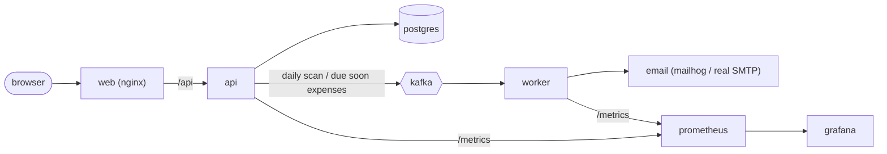

# finflow

[Español](../../README.md) · **English** · [简体中文](./README.zh.md)

Personal finance app born out of the need to replace a basic financial-control Excel
spreadsheet. Its main purpose is to **project the available balance of each account against
the pending expenses at a given date**.

Full-stack project built as a portfolio piece: a monorepo with a REST API, an SPA frontend,
a messaging worker and the whole infrastructure orchestrated with Docker Compose.

## What it is and what it is for

Managing personal finances in a spreadsheet works until the hard question shows up: if I keep
up with the planned spending, how much money will I have (or be short of) in each account at
the end of the month, three months from now, or on any specific date.

finflow models that problem with real data: accounts with their balance, expenses with a due
date and a status, recurring rules that generate future expenses, and loans with their
amortization table. With all of that it computes a **forecast** per account:

```
saldo_proyectado = saldo_actual + ingresos_esperados_hasta_fecha - gastos_pendientes_hasta_fecha
```

The result is shown in a dashboard that displays, for the chosen date, the projected balance
of each account and the breakdown of expenses by category.

## Main features

- JWT authentication with sign-up and sign-in and two roles (`admin`, `user`).
- Mandatory email verification: sign-up does not return a token and access stays blocked
  until the emailed link is opened.
- Bank or cash accounts, with a current balance and a currency.
- Expenses with `pending` / `paid` status; marking an expense as paid deducts the amount from
  the balance of the linked account.
- Per-user expense categories.
- Recurring rules (monthly, quarterly, yearly, weekly, biannual) that generate future expenses
  idempotently.
- Balance forecast per account up to a configurable date.
- Loans with an amortization table; installments materialize as expenses as their due date
  approaches.
- Dashboard with date presets (7 days, end of month, +1 month, +3 months), breakdown by
  category and a pie chart (Recharts).
- Due-soon notifications through a Kafka flow: the API detects "due soon" expenses, the worker
  consumes them and sends an email (captured by Mailhog in development).
- Observability with Prometheus metrics and a Grafana dashboard.
- Interactive API documentation with Swagger/OpenAPI, generated from the Zod schemas (a single
  source of truth for validation and documentation).
- Internationalized interface (Spanish / English / Chinese) and light, dark or system theme.
- Custom duotone icon system: inline SVGs colored with `currentColor`, no external icon
  libraries.

## Tech stack

**Frontend** (`web/`)

- React 19 + Vite 8 + TypeScript
- Tailwind CSS v4, shadcn/ui on top of Radix
- Custom duotone icon system (inline SVG, no external dependencies)
- react-router v7 (data router)
- React Hook Form + Zod for forms and validation
- axios as the HTTP client (data loading with `useEffect` / `useState`)
- Recharts for the dashboard chart
- i18next / react-i18next for i18n
- Geist Variable, Geist Mono and Inter fonts

**Backend** (`api/`)

- Node 20 + Express 5 + TypeScript
- Drizzle ORM on PostgreSQL 16
- JWT authentication (`jsonwebtoken`) and hashing with `bcryptjs`
- Validation with Zod
- Documentation with `zod-openapi` + `swagger-ui-express`
- Metrics with `prom-client`

**Worker** (`worker/`)

- KafkaJS (consumer and producer)
- node-cron for the daily scan
- Nodemailer for sending emails
- Drizzle ORM (reuses the API schema) and `prom-client`

**Infrastructure and tooling**

- Docker Compose
- Apache Kafka in KRaft mode (single node, no Zookeeper)
- Mailhog (fake SMTP in development)
- Prometheus + Grafana
- nginx (serves the SPA and acts as a reverse proxy to the API)
- pnpm workspaces, TypeScript in strict mode, ESLint and Prettier

## Monorepo architecture

The repository is a pnpm monorepo with three workspaces plus the infrastructure config:

```
api/      Node + Express + TypeScript + Drizzle ORM   (@finflow/api)
web/      React + Vite + TypeScript + Tailwind        (@finflow/web)
worker/   Kafka consumer + daily scheduler            (@finflow/worker)
ops/      Prometheus and Grafana configuration        (not a Node package)
```

Overall service flow:



The `worker` workspace depends on `@finflow/api` (`workspace:*`) to reuse the Drizzle database
schema, so both share a single table definition.

## Domain model

- **accounts** — bank or cash accounts with a `current_balance` that is updated on every
  payment.
- **expenses** — individual payments with `status: pending | paid`. Marking an expense as paid
  triggers the balance deduction on the linked account.
- **expenses_categories** — per-user expense categories.
- **recurring_rules** — generate future `expenses` idempotently according to their frequency.
- **forecast** — not a table, but a service calculation: current balance plus expected incomes
  minus pending expenses up to a date, per account.
- **loans / loan_installments** — a loan and its amortization table; each installment
  materializes as an `expense` as its due date approaches.
- **entities** — optional counterparties or payees of an expense.

All tables use UUID primary keys and share time columns (`created_at`, `updated_at`,
`deleted_at` for soft deletes). Every user-owned table includes `user_id`, and all queries
filter by the authenticated user to guarantee data isolation.

## REST API

Base URL: `/api/v1`. Every endpoint, except `/auth/*` and the infrastructure ones, requires the
`Authorization: Bearer <token>` header.

| Resource        | Endpoints                                                                                                                                                                  | Notes                                                                                                      |
| --------------- | -------------------------------------------------------------------------------------------------------------------------------------------------------------------------- | ---------------------------------------------------------------------------------------------------------- |
| Auth            | `POST /auth/register`, `POST /auth/login`, `POST /auth/verify-email`, `POST /auth/resend-verification`                                                                     | Public. `login` and `verify-email` return `{ token }`; `register` only a message (see email verification). |
| Accounts        | `GET /accounts`, `POST /accounts`, `GET /accounts/:id`, `PATCH /accounts/:id`                                                                                              | Accounts CRUD.                                                                                             |
| Expenses        | `GET /expenses`, `POST /expenses`, `GET /expenses/:id`, `PATCH /expenses/:id`, `PATCH /expenses/:id/paid`                                                                  | `:id/paid` marks it paid and deducts from the balance.                                                     |
| Recurring rules | `GET /recurring-rules`, `POST /recurring-rules`, `POST /recurring-rules/generate`, `GET /recurring-rules/:id`, `PATCH /recurring-rules/:id`, `DELETE /recurring-rules/:id` | `generate` creates the future expenses idempotently.                                                       |
| Forecast        | `GET /forecast?date=...`                                                                                                                                                   | Projected balance per account against the pending expenses up to the date.                                 |
| Loans           | `GET /loans`, `POST /loans`, `POST /loans/materialize`, `GET /loans/:id`, `PATCH /loans/:id`                                                                               | `POST /loans` persists the amortization table; `materialize` turns due installments into expenses.         |
| Categories      | `GET /expenses-categories`, `GET /expenses-categories/:id`, `POST /expenses-categories`, `PATCH /expenses-categories/:id`, `DELETE /expenses-categories/:id`               | Categories CRUD.                                                                                           |

Infrastructure endpoints:

| Endpoint                        | Description                                  |
| ------------------------------- | -------------------------------------------- |
| `GET /health`                   | Checks the database connection (`SELECT 1`). |
| `GET /metrics`                  | Prometheus metrics of the API.               |
| `GET /api/v1/docs`              | Interactive Swagger UI.                      |
| `GET /api/v1/docs/openapi.json` | Raw OpenAPI 3.1 specification.               |

## Getting started

**Requirements**: Docker and Docker Compose. For local per-workspace development, also pnpm
(>= 8) and Node (>= 20). **pnpm is used exclusively**; do not use npm or yarn.

### Option A — Everything in Docker (recommended)

```bash
cp .env.example .env
docker compose up -d
```

The `migrate` service applies the Drizzle migrations automatically and the API waits for it to
finish before starting. Once it is up:

| Service                 | URL                               |
| ----------------------- | --------------------------------- |
| Web (SPA)               | http://localhost:8080             |
| API                     | http://localhost:4000             |
| Swagger UI              | http://localhost:4000/api/v1/docs |
| Mailhog (emails)        | http://localhost:8025             |
| Prometheus              | http://localhost:9090             |
| Grafana (admin / admin) | http://localhost:3001             |

### Option B — Local per-workspace development

```bash
pnpm install
docker compose up -d postgres kafka mailhog   # dependencies only
pnpm --filter @finflow/api db:migrate          # apply migrations
pnpm dev:api                                    # in separate terminals:
pnpm dev:web                                    # pnpm dev:web
pnpm dev:worker                                 # pnpm dev:worker
```

In this mode the web app (Vite) uses `VITE_API_URL` to point at the API; in the Docker
deployment nginx acts as a proxy and the web app uses a relative baseURL (no CORS).

## Email verification

Sign-up creates the account but does **not** return a JWT: the API generates a random one-time
token (only its SHA-256 hash is stored, expiring after `EMAIL_VERIFICATION_TTL_HOURS`) and
sends a link to `${FRONTEND_URL}/verify-email?token=...` over SMTP.

1. `POST /auth/register` → 201 with a message; the user sees the "check your email" screen.
2. `POST /auth/login` in the meantime → 403 `EMAIL_NOT_VERIFIED`.
3. When the link is opened, the web app calls `POST /auth/verify-email`, the account becomes
   verified and a JWT is returned, so the user lands straight on the dashboard.
4. If the link expires or gets lost: `POST /auth/resend-verification`. It always responds 200
   with a generic message (it does not reveal whether the email exists) and does not resend if
   one was already sent less than 60 seconds ago.

In development the emails are captured by Mailhog: open http://localhost:8025 and click the
link from there. Seeder users and those that already existed before this feature are created
or migrated as verified, so they do not need to go through the flow.

## Email templates

Every template lives in a single folder, `api/src/emails/`, and is consumed from the api and
from the worker through the `@finflow/api/emails` subpath:

| File              | What it is                                                                                           |
| ----------------- | ---------------------------------------------------------------------------------------------------- |
| `layout.ts`       | Shared HTML shell: brand tokens, teal header with logo, footer, `escapeHtml`, `detailRow`, `button`. |
| `verification.ts` | Account confirmation.                                                                                |
| `dueSoon.ts`      | Due-soon payment notice.                                                                             |
| `index.ts`        | Subpath entry point; re-exports every template.                                                      |
| `assets/`         | Logo (`logo.svg` as the source, `logo@2x.png` is the one attached via CID).                          |

Each template exports a `build*Email(...)` returning `{ subject, text, html, attachments }`,
ready to be spread into `sendMail`. The mailers (`api/src/lib/mailer.ts`,
`worker/src/mailer.ts`) only handle the SMTP transport, not the content.

To add a new template: create the file in that folder building on `renderLayout` and re-export
it from `index.ts`.

## Environment variables

They are loaded from a single `.env` at the root (a copy of `.env.example`, git-ignored). In
the containers the API connects to Postgres over the internal Docker network
(`postgres:5432`); external tools (DBeaver, etc.) use `localhost:${POSTGRES_PORT}`.

| Block    | Variables                                                                                                                                                       | Default / notes                                                                                                                                                                            |
| -------- | --------------------------------------------------------------------------------------------------------------------------------------------------------------- | ------------------------------------------------------------------------------------------------------------------------------------------------------------------------------------------ |
| Postgres | `POSTGRES_USER`, `POSTGRES_PASSWORD`, `POSTGRES_DB`, `POSTGRES_PORT`                                                                                            | `finflow` / `finflow` / `finflow` / `5432`                                                                                                                                                 |
| API      | `API_PORT`, `DATABASE_URL`, `JWT_SECRET`, `JWT_EXPIRES_IN`, `NODE_ENV`, `EMAIL_VERIFICATION_TTL_HOURS`                                                          | `4000`; use a long random string for `JWT_SECRET` in production (`openssl rand -hex 32`); `JWT_EXPIRES_IN=1d`; the verification link expires after `EMAIL_VERIFICATION_TTL_HOURS=24` hours |
| Frontend | `VITE_API_URL`, `FRONTEND_URL`                                                                                                                                  | `VITE_API_URL` is left undefined in the Docker deployment (nginx acts as a proxy); `FRONTEND_URL` feeds the API's CORS allowlist                                                           |
| Worker   | `KAFKA_BROKERS`, `KAFKA_CLIENT_ID`, `KAFKA_DUE_SOON_TOPIC`, `KAFKA_CONSUMER_GROUP`, `DUE_SOON_DAYS`, `DUE_SOON_CRON`, `RUN_SCAN_ON_BOOT`, `WORKER_METRICS_PORT` | Topic `expense.due_soon`; notice window `DUE_SOON_DAYS=3`; daily scan `0 8 * * *`; metrics on `9100`                                                                                       |
| SMTP     | `SMTP_HOST`, `SMTP_PORT`, `SMTP_USER`, `SMTP_PASS`, `SMTP_SECURE`, `MAIL_FROM`                                                                                  | They point to Mailhog by default (`localhost:1025`, no auth/TLS); setting `SMTP_USER`+`SMTP_PASS` enables a real provider with TLS/STARTTLS                                                |

## Database and migrations

The schema lives in `api/src/db/schema.ts` and the versioned migrations in
`api/src/db/migrations/`, managed with drizzle-kit:

```bash
pnpm --filter @finflow/api db:generate   # generate a migration from schema changes
pnpm --filter @finflow/api db:migrate    # apply pending migrations
pnpm --filter @finflow/api db:studio     # open Drizzle Studio
```

In the Docker deployment the migrations are applied by the `migrate` service through
`api/src/migrate.ts`, which only needs `DATABASE_URL`.

## Demo data (seed)

`api/src/db/seed.ts` populates the database with a complete demo user: accounts, categories,
entities, a history of paid expenses, pending expenses, recurring rules and loans with their
materialized installments. It reuses the API's own services (recurring rules, loans, mark as
paid) so the result is identical to an app that has been in use for months. The seed is
idempotent: it deletes the previous demo user (cascading) and recreates it from scratch.

```bash
pnpm --filter @finflow/api db:seed
```

The seeder creates two users and takes their credentials from `.env`:

| Variables                                  | Default                            | Data              |
| ------------------------------------------ | ---------------------------------- | ----------------- |
| `SEED_DEMO_EMAIL` / `SEED_DEMO_PASSWORD`   | `demo@finflow.app` / `Demo1234!`   | full demo dataset |
| `SEED_ADMIN_EMAIL` / `SEED_ADMIN_PASSWORD` | `admin@finflow.app` / `Admin1234!` | none (login only) |

The "admin" user is a regular user for now: it has neither the `admin` role nor any dedicated
functionality, just an email and a password.

One of the pending expenses is deliberately due in ~2 days, inside the `DUE_SOON_DAYS` window
(3 by default), so the due-soon notification flow can be tested end to end.

### Forcing the event flow and seeing the emails in Mailhog

The worker scans daily on a cron schedule (`DUE_SOON_CRON`), but a one-off scan can be
triggered to see it right away. The scan looks for `pending` expenses due within
`DUE_SOON_DAYS` that have **not been notified yet**, publishes one Kafka event per expense, and
the consumer (already running) sends the corresponding email to Mailhog.

```bash
# With the whole stack in Docker: run the scan inside the worker container
docker compose exec worker pnpm scan

# In local per-workspace development
pnpm --filter @finflow/worker scan

# Alternative: start the worker running a scan right at boot
RUN_SCAN_ON_BOOT=true docker compose up worker
```

Then open **http://localhost:8025** (Mailhog) to see the "Pago próximo: …" emails.

> Every notified expense is stamped with `due_soon_notified_at`, so a second scan does **not**
> resend the same email. To repeat the test, run the seed again (it recreates the demo user
> from scratch) and trigger the scan once more.

## Icon system

The frontend uses a **custom duotone** icon set, without depending on any external icon
library. Each glyph is an SVG with two layers (`.primary` and `.secondary`) that inherit the
current text color, so Tailwind's `text-*` utilities tint the icons like any inline SVG.

- **Source**: the original SVGs in `extra/icons/` (about 200 icons), along with
  `extra/icons/icons-data.js` (an autogenerated aggregate) and a preview `index.html`.
- **Generation**: from those, `web/src/components/icon/icons.gen.ts` is generated, exporting
  the `ICON_PATHS` map and the `IconName` type (a union of every available name). It is an
  autogenerated file: it is not edited by hand.
- **Component**: `web/src/components/icon/Icon.tsx` exposes `<Icon name size title className />`.
  It renders an SVG with `viewBox="0 0 24 24"` and the `.finflow-icon` class; if `title` is
  passed it is accessible (`role="img"` + `aria-label`), and if not, it is marked as decorative
  (`aria-hidden`).
- **Duotone color**: the `.finflow-icon .primary` / `.secondary` rules in `web/src/index.css`
  apply `fill: currentColor`; the primary layer (background shape) is dimmed (`opacity: 0.38`)
  and the secondary one (detail) is at full intensity, which produces the two-tone effect from
  a single color.

Typical usage:

```tsx
import { Icon } from '@/components/icon/Icon';

<Icon name="wallet" size={20} className="text-brand" title="Cuentas" />;
```

## Observability

- **API**: exposes at `/metrics` the default Node metrics plus an
  `http_request_duration_seconds` histogram labeled by method, route and status code.
- **Worker**: exposes `/metrics` on port `9100` with the counters
  `worker_due_soon_events_produced_total`, `worker_due_soon_events_consumed_total`,
  `worker_emails_sent_total` and `worker_errors_total`.
- **Prometheus** scrapes both (`ops/prometheus/prometheus.yml`) and **Grafana** loads the
  "finflow overview" dashboard (`ops/grafana/provisioning/dashboards/finflow.json`) with panels
  for target availability, API request rate, due-soon events and emails/errors.

## Useful scripts (root)

```bash
pnpm dev:api        # start the API in watch mode
pnpm dev:web        # start the frontend (Vite)
pnpm dev:worker     # start the worker
pnpm build          # recursive build of every workspace
pnpm lint           # ESLint across every workspace
pnpm typecheck      # type checking across every workspace
pnpm format         # Prettier across the whole repo
```
