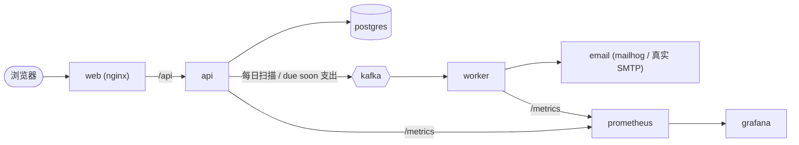

# finflow

[Español](../../README.md) · [English](./README.en.md) · **简体中文**

个人财务管理应用，最初的想法来自于替换一份用于基础财务管理的 Excel 表格。它的核心功能是
**在指定日期预测每个账户的可用余额与待付支出之间的关系**。

作为作品集而构建的全栈项目：一个包含 REST API、SPA 前端、消息 worker，以及由 Docker Compose
编排的全部基础设施的 monorepo。

## 这是什么，用来做什么

用 Excel 管理个人财务在遇到那个棘手的问题之前都还算好用：如果按计划继续支出，到月底、三个月后
或任意一个具体日期，我在每个账户里会剩下（或者还差）多少钱。

finflow 用真实数据为这个问题建模：带余额的账户、带到期日和状态的支出、生成未来支出的周期性规则，
以及带摊销表的贷款。基于这些数据，它按账户计算出一份**预测**：

```
saldo_proyectado = saldo_actual + ingresos_esperados_hasta_fecha - gastos_pendientes_hasta_fecha
```

结果呈现在仪表盘上：针对所选日期，显示每个账户的预测余额以及按类别拆分的支出明细。

## 主要功能

- JWT 认证，支持注册与登录，包含两种角色（`admin`、`user`）。
- 强制邮箱验证：注册不会返回 token，在打开邮件中的链接之前访问始终被阻止。
- 银行或现金类型的账户，带当前余额和币种。
- 支出具有 `pending` / `paid` 状态；把支出标记为已付会从关联账户的余额中扣除对应金额。
- 每个用户自己的支出类别。
- 周期性规则（每月、每季度、每年、每周、每半年），以幂等的方式生成未来支出。
- 按账户预测余额，截止日期可配置。
- 贷款及其摊销表；每期还款在临近到期时会实体化为一笔支出。
- 仪表盘提供日期预设（7 天、月末、+1 个月、+3 个月）、按类别拆分以及饼图（Recharts）。
- 通过 Kafka 流程发送临近到期通知：API 检测「due soon」的支出，worker 消费这些事件并发送邮件
  （开发环境由 Mailhog 捕获）。
- 基于 Prometheus 指标和 Grafana 仪表盘的可观测性。
- 使用 Swagger/OpenAPI 的交互式 API 文档，由 Zod schema 生成（校验与文档共用同一份事实来源）。
- 界面已国际化（西班牙语 / 英语 / 中文），并支持浅色、深色或跟随系统主题。
- 自研双色调图标系统：内联 SVG，用 `currentColor` 上色，不依赖任何外部图标库。

## 技术栈

**前端**（`web/`）

- React 19 + Vite 8 + TypeScript
- Tailwind CSS v4，基于 Radix 的 shadcn/ui
- 自研双色调图标系统（内联 SVG，无外部依赖）
- react-router v7（data router）
- React Hook Form + Zod 负责表单与校验
- axios 作为 HTTP 客户端（用 `useEffect` / `useState` 加载数据）
- Recharts 绘制仪表盘图表
- i18next / react-i18next 负责国际化
- Geist Variable、Geist Mono 与 Inter 字体

**后端**（`api/`）

- Node 20 + Express 5 + TypeScript
- Drizzle ORM，运行在 PostgreSQL 16 之上
- JWT 认证（`jsonwebtoken`）与 `bcryptjs` 哈希
- 使用 Zod 校验
- 使用 `zod-openapi` + `swagger-ui-express` 生成文档
- 使用 `prom-client` 暴露指标

**Worker**（`worker/`）

- KafkaJS（消费者与生产者）
- node-cron 负责每日扫描
- Nodemailer 负责发送邮件
- Drizzle ORM（复用 API 的 schema）与 `prom-client`

**基础设施与工具链**

- Docker Compose
- Apache Kafka，KRaft 模式（单节点，无 Zookeeper）
- Mailhog（开发环境的伪 SMTP）
- Prometheus + Grafana
- nginx（提供 SPA 静态资源，并反向代理到 API）
- pnpm workspaces、TypeScript 严格模式、ESLint 与 Prettier

## Monorepo 架构

本仓库是一个 pnpm monorepo，包含三个 workspace 以及基础设施配置：

```
api/      Node + Express + TypeScript + Drizzle ORM   (@finflow/api)
web/      React + Vite + TypeScript + Tailwind        (@finflow/web)
worker/   Kafka 消费者 + 每日调度                      (@finflow/worker)
ops/      Prometheus 与 Grafana 配置                   (不是 Node 包)
```

服务的整体流程：



`worker` 这个 workspace 依赖 `@finflow/api`（`workspace:*`）来复用 Drizzle 的数据库 schema，
因此两者共享同一份表定义。

## 领域模型

- **accounts** — 银行账户或现金账户，带有会在每次付款时更新的 `current_balance`。
- **expenses** — 单笔付款，带 `status: pending | paid`。把支出标记为已付会触发关联账户的余额扣减。
- **expenses_categories** — 每个用户的支出类别。
- **recurring_rules** — 按其频率以幂等方式生成未来的 `expenses`。
- **forecast** — 不是一张表，而是服务层的计算：按账户，用当前余额加上预期收入、减去截止某个日期的
  待付支出。
- **loans / loan_installments** — 贷款及其摊销表；每一期在临近到期时实体化为一笔 `expense`。
- **entities** — 支出可选的交易对手或收款方。

所有表都使用 UUID 主键，并共享时间列（`created_at`、`updated_at`、用于软删除的 `deleted_at`）。
每张属于用户的表都包含 `user_id`，且所有查询都按已认证用户过滤，以保证数据隔离。

## REST API

Base URL：`/api/v1`。除 `/auth/*` 和基础设施相关的端点外，其余端点都要求
`Authorization: Bearer <token>` 请求头。

| 资源            | 端点                                                                                                                                                                       | 说明                                                                                            |
| --------------- | -------------------------------------------------------------------------------------------------------------------------------------------------------------------------- | ----------------------------------------------------------------------------------------------- |
| Auth            | `POST /auth/register`、`POST /auth/login`、`POST /auth/verify-email`、`POST /auth/resend-verification`                                                                     | 公开端点。`login` 与 `verify-email` 返回 `{ token }`；`register` 只返回一条消息（见邮箱验证）。 |
| Accounts        | `GET /accounts`、`POST /accounts`、`GET /accounts/:id`、`PATCH /accounts/:id`                                                                                              | 账户的 CRUD。                                                                                   |
| Expenses        | `GET /expenses`、`POST /expenses`、`GET /expenses/:id`、`PATCH /expenses/:id`、`PATCH /expenses/:id/paid`                                                                  | `:id/paid` 标记为已付并从余额中扣除。                                                           |
| Recurring rules | `GET /recurring-rules`、`POST /recurring-rules`、`POST /recurring-rules/generate`、`GET /recurring-rules/:id`、`PATCH /recurring-rules/:id`、`DELETE /recurring-rules/:id` | `generate` 以幂等方式创建未来的支出。                                                           |
| Forecast        | `GET /forecast?date=...`                                                                                                                                                   | 按账户给出预测余额与截止该日期的待付支出的对比。                                                |
| Loans           | `GET /loans`、`POST /loans`、`POST /loans/materialize`、`GET /loans/:id`、`PATCH /loans/:id`                                                                               | `POST /loans` 会持久化摊销表；`materialize` 把到期的分期转换成支出。                            |
| Categories      | `GET /expenses-categories`、`GET /expenses-categories/:id`、`POST /expenses-categories`、`PATCH /expenses-categories/:id`、`DELETE /expenses-categories/:id`               | 类别的 CRUD。                                                                                   |

基础设施端点：

| 端点                            | 描述                           |
| ------------------------------- | ------------------------------ |
| `GET /health`                   | 检查数据库连接（`SELECT 1`）。 |
| `GET /metrics`                  | API 的 Prometheus 指标。       |
| `GET /api/v1/docs`              | 交互式 Swagger UI。            |
| `GET /api/v1/docs/openapi.json` | 原始的 OpenAPI 3.1 规范。      |

## 快速开始

**环境要求**：Docker 与 Docker Compose。若要按 workspace 在本地开发，还需要 pnpm（>= 8）和
Node（>= 20）。本项目**只使用 pnpm**；不要使用 npm 或 yarn。

### 方案 A —— 全部跑在 Docker 里（推荐）

```bash
cp .env.example .env
docker compose up -d
```

`migrate` 服务会自动应用 Drizzle 迁移，API 会等它结束后再启动。启动完成后：

| 服务                     | URL                               |
| ------------------------ | --------------------------------- |
| Web (SPA)                | http://localhost:8080             |
| API                      | http://localhost:4000             |
| Swagger UI               | http://localhost:4000/api/v1/docs |
| Mailhog（邮件）          | http://localhost:8025             |
| Prometheus               | http://localhost:9090             |
| Grafana（admin / admin） | http://localhost:3001             |

### 方案 B —— 按 workspace 在本地开发

```bash
pnpm install
docker compose up -d postgres kafka mailhog   # 只启动依赖服务
pnpm --filter @finflow/api db:migrate          # 应用迁移
pnpm dev:api                                    # 在不同终端中分别执行：
pnpm dev:web                                    # pnpm dev:web
pnpm dev:worker                                 # pnpm dev:worker
```

在这种模式下，前端（Vite）通过 `VITE_API_URL` 指向 API；而在 Docker 部署中由 nginx 做代理，
前端使用相对的 baseURL（因此没有 CORS 问题）。

## 邮箱验证

注册会创建账户，但**不会**返回 JWT：API 生成一个一次性的随机 token（只保存它的 SHA-256 哈希，
有效期由 `EMAIL_VERIFICATION_TTL_HOURS` 决定），并通过 SMTP 发送一个指向
`${FRONTEND_URL}/verify-email?token=...` 的链接。

1. `POST /auth/register` → 201 并返回一条消息；用户会看到「请查收邮件」的页面。
2. 在此期间调用 `POST /auth/login` → 403 `EMAIL_NOT_VERIFIED`。
3. 打开链接后，前端会调用 `POST /auth/verify-email`，账户被标记为已验证并返回 JWT，用户因此
   直接进入仪表盘。
4. 如果链接过期或丢失：`POST /auth/resend-verification`。它始终返回 200 和一条通用消息
   （不会泄露该邮箱是否存在），并且如果 60 秒内已经发送过一次，则不会重复发送。

在开发环境中邮件由 Mailhog 捕获：打开 http://localhost:8025 并从那里点击链接。seeder 创建的用户
以及此功能上线前就已存在的用户，会被创建或迁移为已验证状态，因此无需走这个流程。

## 邮件模板

所有模板都放在同一个目录 `api/src/emails/` 中，并由 api 和 worker 通过 `@finflow/api/emails`
子路径引用：

| 文件              | 内容                                                                                            |
| ----------------- | ----------------------------------------------------------------------------------------------- |
| `layout.ts`       | 共享的 HTML 外壳：品牌 token、带 logo 的青绿色页头、页脚、`escapeHtml`、`detailRow`、`button`。 |
| `verification.ts` | 账户确认邮件。                                                                                  |
| `dueSoon.ts`      | 临近到期的付款提醒。                                                                            |
| `index.ts`        | 子路径入口；重新导出每个模板。                                                                  |
| `assets/`         | Logo（`logo.svg` 为源文件，通过 CID 附加的是 `logo@2x.png`）。                                  |

每个模板都导出一个 `build*Email(...)`，返回 `{ subject, text, html, attachments }`，可直接展开
传给 `sendMail`。mailer（`api/src/lib/mailer.ts`、`worker/src/mailer.ts`）只负责 SMTP 传输，
不负责内容。

新增模板的方式：在该目录下创建文件，基于 `renderLayout` 编写，并从 `index.ts` 重新导出。

## 环境变量

变量从根目录下唯一的 `.env` 加载（由 `.env.example` 复制而来，已被 git 忽略）。在容器中，API 通过
Docker 内部网络连接 Postgres（`postgres:5432`）；外部工具（DBeaver 等）使用
`localhost:${POSTGRES_PORT}`。

| 分组     | 变量                                                                                                                                                            | 默认值 / 说明                                                                                                                                                  |
| -------- | --------------------------------------------------------------------------------------------------------------------------------------------------------------- | -------------------------------------------------------------------------------------------------------------------------------------------------------------- |
| Postgres | `POSTGRES_USER`、`POSTGRES_PASSWORD`、`POSTGRES_DB`、`POSTGRES_PORT`                                                                                            | `finflow` / `finflow` / `finflow` / `5432`                                                                                                                     |
| API      | `API_PORT`、`DATABASE_URL`、`JWT_SECRET`、`JWT_EXPIRES_IN`、`NODE_ENV`、`EMAIL_VERIFICATION_TTL_HOURS`                                                          | `4000`；生产环境请为 `JWT_SECRET` 使用一段长随机字符串（`openssl rand -hex 32`）；`JWT_EXPIRES_IN=1d`；验证链接在 `EMAIL_VERIFICATION_TTL_HOURS=24` 小时后过期 |
| Frontend | `VITE_API_URL`、`FRONTEND_URL`                                                                                                                                  | 在 Docker 部署中不定义 `VITE_API_URL`（由 nginx 代理）；`FRONTEND_URL` 用于 API 的 CORS 白名单                                                                 |
| Worker   | `KAFKA_BROKERS`、`KAFKA_CLIENT_ID`、`KAFKA_DUE_SOON_TOPIC`、`KAFKA_CONSUMER_GROUP`、`DUE_SOON_DAYS`、`DUE_SOON_CRON`、`RUN_SCAN_ON_BOOT`、`WORKER_METRICS_PORT` | 主题 `expense.due_soon`；提醒窗口 `DUE_SOON_DAYS=3`；每日扫描 `0 8 * * *`；指标端口 `9100`                                                                     |
| SMTP     | `SMTP_HOST`、`SMTP_PORT`、`SMTP_USER`、`SMTP_PASS`、`SMTP_SECURE`、`MAIL_FROM`                                                                                  | 默认指向 Mailhog（`localhost:1025`，无认证/TLS）；设置 `SMTP_USER`+`SMTP_PASS` 会启用带 TLS/STARTTLS 的真实服务商                                              |

## 数据库与迁移

schema 位于 `api/src/db/schema.ts`，版本化的迁移位于 `api/src/db/migrations/`，由 drizzle-kit
管理：

```bash
pnpm --filter @finflow/api db:generate   # 根据 schema 变更生成迁移
pnpm --filter @finflow/api db:migrate    # 应用待执行的迁移
pnpm --filter @finflow/api db:studio     # 打开 Drizzle Studio
```

在 Docker 部署中，迁移由 `migrate` 服务通过 `api/src/migrate.ts` 应用，它只需要 `DATABASE_URL`。

## 演示数据（seed）

`api/src/db/seed.ts` 会用一个完整的演示用户填充数据库：账户、类别、实体、已付支出的历史记录、
待付支出、周期性规则，以及带已实体化分期的贷款。它复用 API 自身的服务（周期性规则、贷款、标记为
已付），因此结果与一个已经使用了数月的应用完全一致。seed 是幂等的：它会（级联）删除之前的演示
用户并从零重新创建。

```bash
pnpm --filter @finflow/api db:seed
```

seeder 会创建两个用户，其凭据取自 `.env`：

| 变量                                       | 默认值                             | 数据             |
| ------------------------------------------ | ---------------------------------- | ---------------- |
| `SEED_DEMO_EMAIL` / `SEED_DEMO_PASSWORD`   | `demo@finflow.app` / `Demo1234!`   | 完整的演示数据集 |
| `SEED_ADMIN_EMAIL` / `SEED_ADMIN_PASSWORD` | `admin@finflow.app` / `Admin1234!` | 无（仅用于登录） |

「admin」用户目前只是一个普通用户：它既没有 `admin` 角色，也没有专属功能，只有邮箱和密码。

其中一笔待付支出被刻意设置为约 2 天后到期，落在 `DUE_SOON_DAYS` 窗口内（默认 3 天），以便端到端
测试临近到期的通知流程。

### 手动触发事件流程并在 Mailhog 中查看邮件

worker 通过 cron（`DUE_SOON_CRON`）每天扫描，但也可以手动触发一次扫描来立即看到效果。扫描会查找
在 `DUE_SOON_DAYS` 内到期、且**尚未通知过**的 `pending` 支出，为每一笔发布一个 Kafka 事件，
消费者（已在运行）随后把对应的邮件发送到 Mailhog。

```bash
# 整套服务跑在 Docker 中时：在 worker 容器内触发扫描
docker compose exec worker pnpm scan

# 按 workspace 在本地开发时
pnpm --filter @finflow/worker scan

# 另一种方式：启动 worker 时立即执行一次扫描
RUN_SCAN_ON_BOOT=true docker compose up worker
```

之后打开 **http://localhost:8025**（Mailhog）即可看到标题为「Pago próximo: …」的邮件。

> 每一笔已通知的支出都会被打上 `due_soon_notified_at`，因此第二次扫描**不会**重复发送同一封邮件。
> 若要重复测试，请重新执行 seed（它会从零重建演示用户）并再次触发扫描。

## 图标系统

前端使用一套**自研的双色调**图标集，不依赖任何外部图标库。每个字形都是一个包含两层
（`.primary` 与 `.secondary`）的 SVG，两层都继承当前文字颜色，因此 Tailwind 的 `text-*` 工具类
可以像给任何内联 SVG 上色一样为图标着色。

- **来源**：`extra/icons/` 中的原始 SVG（约 200 个图标），以及 `extra/icons/icons-data.js`
  （自动生成的聚合文件）和一个用于预览的 `index.html`。
- **生成**：由此生成 `web/src/components/icon/icons.gen.ts`，它导出 `ICON_PATHS` 映射和
  `IconName` 类型（所有可用名称的联合类型）。这是一个自动生成的文件：不要手动编辑。
- **组件**：`web/src/components/icon/Icon.tsx` 暴露 `<Icon name size title className />`。
  它渲染一个 `viewBox="0 0 24 24"`、带 `.finflow-icon` 类的 SVG；传入 `title` 时具备无障碍语义
  （`role="img"` + `aria-label`），否则被标记为装饰性元素（`aria-hidden`）。
- **双色调着色**：`web/src/index.css` 中的 `.finflow-icon .primary` / `.secondary` 规则应用
  `fill: currentColor`；主层（背景形状）被减淡（`opacity: 0.38`），次层（细节）保持全强度，从而用
  单一颜色产生双色调效果。

典型用法：

```tsx
import { Icon } from '@/components/icon/Icon';

<Icon name="wallet" size={20} className="text-brand" title="Cuentas" />;
```

## 可观测性

- **API**：在 `/metrics` 暴露 Node 的默认指标，以及一个按方法、路由和状态码打标签的
  `http_request_duration_seconds` 直方图。
- **Worker**：在 `9100` 端口的 `/metrics` 暴露计数器
  `worker_due_soon_events_produced_total`、`worker_due_soon_events_consumed_total`、
  `worker_emails_sent_total` 和 `worker_errors_total`。
- **Prometheus** 抓取两者（`ops/prometheus/prometheus.yml`），**Grafana** 加载
  「finflow overview」仪表盘（`ops/grafana/provisioning/dashboards/finflow.json`），包含
  target 可用性、API 请求速率、due-soon 事件以及邮件/错误等面板。

## 常用脚本（根目录）

```bash
pnpm dev:api        # 以 watch 模式启动 API
pnpm dev:web        # 启动前端（Vite）
pnpm dev:worker     # 启动 worker
pnpm build          # 递归构建所有 workspace
pnpm lint           # 对所有 workspace 运行 ESLint
pnpm typecheck      # 对所有 workspace 做类型检查
pnpm format         # 对整个仓库运行 Prettier
```
